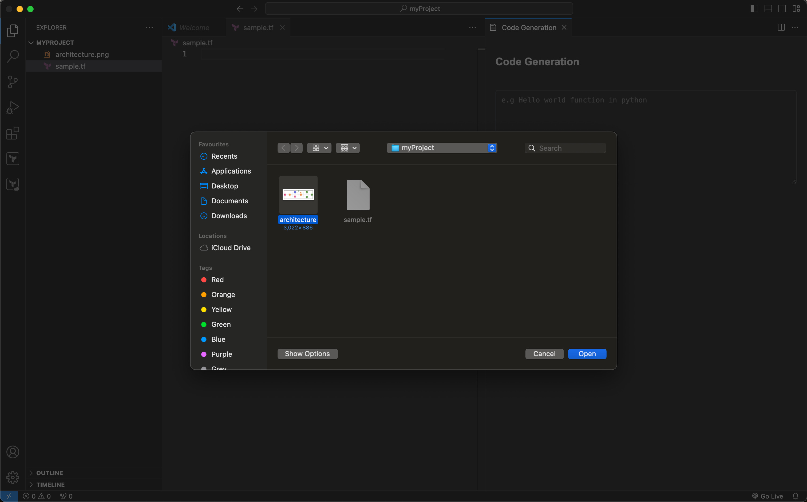

# VSCode Code Generation Extension
This is a VSCode extension built to generate code as a developer tool. It utilizes Amazon Bedrock with Claude 3 as its underlying foundational model.

⚠️ **Warning**: This extension may incur costs associated with the usage of AWS services and Anthropic's Claude 3 model. It is recommended to set up AWS Cost and Usage Reports and/or Billing Alerts/Alarms before running this extension to monitor and control your spending.

⚠️ **Security Note**: By default, the Application Load Balancer (ALB) deployed by this extension accepts traffic from 0.0.0.0/0 (any IP address). It is advisable to review and restrict the ALB security group rules to allow only trusted sources if required.

## Prerequisites
1. Enable Claude 3 Sonnet Access in Amazon Bedrock within your AWS environment.

## Installation
1. Download the `cfTemplateBedrockCoder.yaml` file and deploy the CloudFormation template in your AWS environment.
2. Locate the ALB endpoint under the outputs section.

3. Install Bedrock Coder from the VSCode extension marketplace.

4. Open the extension settings in VSCode and paste the ALB endpoint.

## Usage
1. Open the Code Generation Extension by going to the Command Palette (`Ctrl+Shift+P` or `Cmd+Shift+P`) and selecting "Code Generation".

2. Enter your description in the provided text area and attach any relevant image, such as architecture diagrams.

3. Click the "Generate" button.
4. The generated code will be displayed in the response area.

5. Click on the "Copy" button to copy the generated code to your clipboard and paste it in your selected file.

#### If you find this extension useful, I will greatly appreciate it if you star this GitHub repository and leave a review on my VSCode extension itself. Cheers!

## Contributing
If you'd like to contribute to this project, please follow these steps:
1. Fork the repository.
2. Create a new branch for your feature or bug fix.
3. Make your changes and commit them with descriptive commit messages.
4. Push your changes to your forked repository.
5. Create a pull request describing your changes.

## Acknowledgments
- [Amazon Bedrock](https://aws.amazon.com/bedrock/)
- [Claude 3](https://www.anthropic.com/)
- [VSCode Extension API](https://code.visualstudio.com/api)